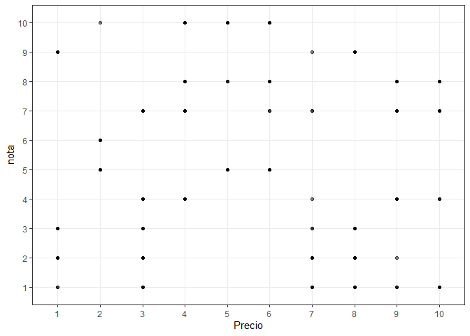
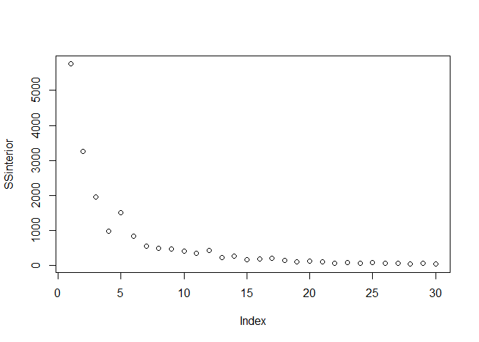
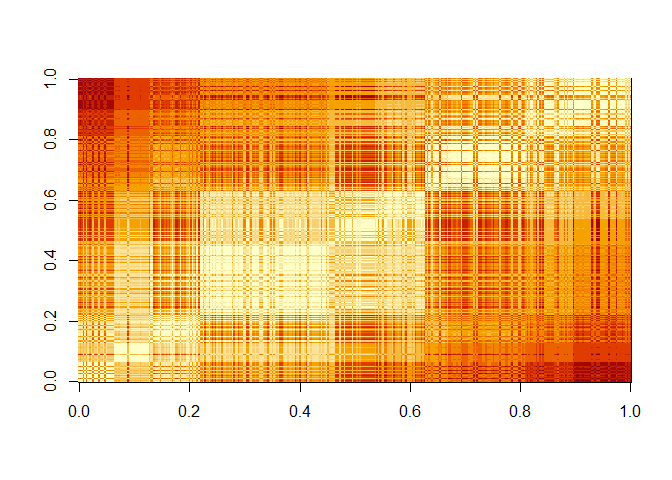
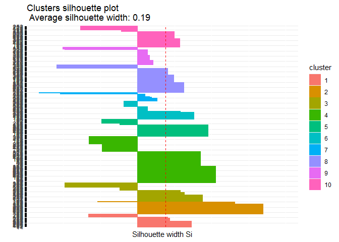
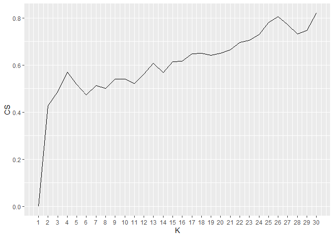

Untitled
================

\#Librerias

``` r
library(psych)
library(dplyr)
```

    ## 
    ## Attaching package: 'dplyr'

    ## The following objects are masked from 'package:stats':
    ## 
    ##     filter, lag

    ## The following objects are masked from 'package:base':
    ## 
    ##     intersect, setdiff, setequal, union

``` r
library(stringr)
library(datasets)
library(tidyverse)
```

    ## -- Attaching packages --------------------------------------- tidyverse 1.3.1 --

    ## v ggplot2 3.3.3     v readr   1.4.0
    ## v tibble  3.1.1     v purrr   0.3.4
    ## v tidyr   1.1.3     v forcats 0.5.1

    ## -- Conflicts ------------------------------------------ tidyverse_conflicts() --
    ## x ggplot2::%+%()   masks psych::%+%()
    ## x ggplot2::alpha() masks psych::alpha()
    ## x dplyr::filter()  masks stats::filter()
    ## x dplyr::lag()     masks stats::lag()

``` r
library(tm)
```

    ## Loading required package: NLP

    ## 
    ## Attaching package: 'NLP'

    ## The following object is masked from 'package:ggplot2':
    ## 
    ##     annotate

``` r
library(tidytext)
library(quanteda)
```

    ## Package version: 3.0.0
    ## Unicode version: 10.0
    ## ICU version: 61.1

    ## Parallel computing: 8 of 8 threads used.

    ## See https://quanteda.io for tutorials and examples.

    ## 
    ## Attaching package: 'quanteda'

    ## The following object is masked from 'package:tm':
    ## 
    ##     stopwords

    ## The following objects are masked from 'package:NLP':
    ## 
    ##     meta, meta<-

``` r
library(quanteda.textstats)
library(ggplot2)
library(wordcloud)
```

    ## Loading required package: RColorBrewer

``` r
library(ggplot.multistats)
library(factoextra)
```

    ## Welcome! Want to learn more? See two factoextra-related books at https://goo.gl/ve3WBa

``` r
library(tibble)
library(flexclust)
```

    ## Loading required package: grid

    ## Loading required package: lattice

    ## Loading required package: modeltools

    ## Loading required package: stats4

``` r
library(cluster)
```

\#cargando datoss

``` r
setwd("C:/Users/Dieca/OneDrive/Escritorio/proyecto 1")

sanguchez <- read.csv("sanguchezz.csv", sep = ";")

sanguchez <- sanguchez

sanguchez <- sanguchez[,!(colnames(sanguchez) %in% c("url", "Direccion", "texto", "Ingredientes", "Local"))] 

ordenar_NOTAS <- sanguchez[order(sanguchez$nota,decreasing = TRUE),]
```

## funcion que pasa las notas a valor numerico

``` r
sanguchez$Precio <- as.numeric(gsub('[$.aprox]', '', sanguchez$Precio))
```

    ## Warning: NAs introducidos por coerción

## Borramos los datos NA

``` r
sanguchez <- sanguchez[!is.na(sanguchez$Precio),]
sanguchez <- sanguchez[!is.na(sanguchez$nota),]

escala_data_san = scale(sanguchez) %>% as_tibble()

escala_data_san %>% summary()
```

    ##      Precio             nota        
    ##  Min.   :-2.8637   Min.   :-1.9432  
    ##  1st Qu.:-0.6215   1st Qu.:-0.1379  
    ##  Median :-0.0466   Median :-0.1379  
    ##  Mean   : 0.0000   Mean   : 0.0000  
    ##  3rd Qu.: 0.5466   3rd Qu.: 0.7648  
    ##  Max.   : 4.4534   Max.   : 1.6674

``` r
escala_data_san$Precio %>% as.numeric()
```

    ##   [1] -0.454264526  0.481267787  0.632834474  1.364535724 -0.616284089
    ##   [6]  0.219945911 -0.302697839  1.003911537  1.474290912 -0.093640339
    ##  [11]  1.474290912  0.136322911 -0.302697839 -0.830568026 -0.830568026
    ##  [16]  1.474290912  0.376739037  0.742589662 -0.093640339  0.376739037
    ##  [21]  0.951647162 -0.145904714  1.526555287  0.429003412 -0.093640339
    ##  [26] -0.145904714 -0.825341589  0.089284974  1.003911537 -0.773077214
    ##  [31] -0.250433464  0.742589662  0.219945911  0.794854037 -0.145904714
    ##  [36]  0.115417161  0.742589662  0.219945911  0.193813724 -0.093640339
    ##  [41] -0.511755339 -1.347985339  0.429003412  0.167681536  0.376739037
    ##  [46] -1.165060026 -0.302697839  0.272210286 -0.198169089 -0.569246151
    ##  [51]  0.664193099  1.474290912  0.141549349  0.010888411 -0.668548464
    ##  [56]  1.108440287 -0.093640339  0.476041349  0.376739037  0.429003412
    ##  [61] -0.093640339  3.564865912  2.415049662  0.418550537 -0.302697839
    ##  [66]  0.899382787 -1.086663464 -0.302697839  0.951647162  0.010888411
    ##  [71] -0.302697839  0.376739037 -1.875855526 -0.882832401  0.794854037
    ##  [76] -0.302697839 -0.982134714 -1.347985339  4.401095912 -1.818364714
    ##  [81] -0.041375964 -0.145904714  1.265233412 -1.086663464 -0.145904714
    ##  [86]  1.239101224  0.789627599  0.794854037 -0.328830026  0.429003412
    ##  [91] -0.145904714  1.369762162  1.631084037 -0.825341589  0.476041349
    ##  [96] -0.830568026 -1.661571589  0.951647162 -2.314876276  0.115417161
    ## [101] -0.564019714 -0.616284089 -1.457740526 -0.145904714  2.310520912
    ## [106]  0.219945911 -0.929870339  0.533532162 -0.590151901  0.742589662
    ## [111]  0.585796537 -1.191192214 -0.198169089 -0.255659901  0.272210286
    ## [116]  0.429003412 -0.616284089 -0.093640339 -0.668548464 -0.642416276
    ## [121] -0.982134714  1.474290912 -1.086663464 -0.825341589 -0.773077214
    ## [126] -1.217324401  0.010888411  0.742589662  0.951647162 -1.347985339
    ## [131]  0.998685099 -0.825341589 -1.243456589 -0.145904714  0.376739037
    ## [136] -1.975157839 -1.086663464 -0.564019714  0.690325287  0.219945911
    ## [141] -0.354962214 -2.262611901 -0.564019714 -0.354962214 -1.609307214
    ## [146]  0.533532162  1.003911537 -0.825341589  1.317497787 -0.616284089
    ## [151] -0.093640339  0.219945911 -1.400249714 -0.093640339  1.991708224
    ## [156]  0.977779349 -1.138927839 -0.046602401 -1.347985339 -0.046602401
    ## [161] -0.307924276  0.219945911  1.212969037  1.474290912  0.585796537
    ## [166]  0.585796537  0.429003412 -0.668548464 -0.616284089  0.951647162
    ## [171] -0.590151901 -1.347985339  0.617155162 -0.203395526 -0.198169089
    ## [176] -0.093640339 -0.564019714  0.115417161 -2.863652214 -0.077961026
    ## [181] -0.616284089  0.324474662 -0.302697839 -0.093640339  1.265233412
    ## [186] -1.295720964  4.453360287 -0.041375964  1.212969037  0.272210286
    ## [191]  0.429003412  0.476041349 -0.825341589  0.742589662 -0.621510526
    ## [196]  0.167681536  0.585796537  0.481267787 -0.459490964 -0.145904714
    ## [201]  0.214719474  0.899382787  1.265233412 -0.825341589  0.115417161
    ## [206] -0.354962214 -0.825341589  1.416800099  1.056175912 -0.569246151
    ## [211] -1.086663464 -1.609307214 -2.131950964  2.467314037 -0.302697839
    ## [216] -0.825341589  0.951647162  0.533532162  0.998685099  0.005661974
    ## [221] -0.046602401  0.429003412 -0.929870339  0.429003412  0.063152786
    ## [226] -1.091889901 -0.459490964 -0.041375964  0.951647162  0.951647162
    ## [231] -0.145904714  0.219945911  0.429003412 -1.086663464 -0.861926651
    ## [236] -0.145904714  0.063152786  0.219945911  0.476041349 -0.145904714
    ## [241]  0.585796537 -1.191192214  0.167681536  0.899382787  1.474290912
    ## [246]  0.376739037 -0.511755339 -1.086663464  0.219945911  1.474290912
    ## [251] -0.145904714  1.521328849 -0.564019714 -1.347985339 -1.295720964
    ## [256]  0.742589662 -1.034399089  0.946420724 -0.041375964  1.996934662
    ## [261] -1.086663464 -0.041375964 -0.511755339  0.429003412  0.690325287
    ## [266] -0.354962214  0.167681536  0.742589662 -0.198169089 -1.400249714
    ## [271] -1.400249714  1.526555287 -1.086663464 -0.302697839  0.167681536
    ## [276]  0.476041349 -2.288744089 -0.093640339  0.089284974 -0.250433464
    ## [281] -2.367140651  1.108440287 -1.943799214 -1.008266901  0.005661974
    ## [286]  0.010888411 -1.347985339  0.429003412 -0.564019714  1.317497787
    ## [291]  1.526555287 -0.825341589 -0.825341589 -0.982134714 -0.982134714
    ## [296] -0.250433464  0.429003412  1.521328849  0.742589662  3.564865912
    ## [301] -0.720812839  0.977779349 -1.086663464 -0.511755339  0.115417161
    ## [306] -0.145904714 -0.564019714 -0.778303651  0.010888411 -0.151131151
    ## [311] -0.041375964  0.115417161  0.690325287 -1.713835964  0.429003412
    ## [316] -1.870629089 -0.255659901  0.324474662  0.429003412  0.455135599
    ## [321]  0.429003412 -0.302697839  1.474290912  0.533532162  0.429003412
    ## [326] -0.877605964  0.899382787 -0.046602401  1.056175912 -0.354962214
    ## [331] -0.093640339 -0.093640339  0.742589662 -1.091889901 -0.093640339
    ## [336]  0.376739037 -0.302697839 -0.825341589  0.951647162 -0.929870339
    ## [341] -1.870629089 -1.060531276  1.474290912  1.944670287 -1.766100339
    ## [346]  0.737363224 -0.145904714 -1.609307214  1.422026537  1.317497787
    ## [351]  0.376739037 -1.138927839 -0.825341589 -0.302697839 -0.982134714
    ## [356] -0.302697839 -0.621510526 -1.138927839  0.429003412 -0.616284089

``` r
escala_data_san$nota %>% as.integer()
```

    ##   [1]  0  0  0  0  0  0  0  0  0  0  0  0  0  0 -1  0  0  0  0  0  0  0  0  0 -1
    ##  [26] -1 -1  0  0  0  1  0  1  0  0  0  0  0  0 -1  0  0  0  0  0  0  1  0  0 -1
    ##  [51]  0  1  0  0 -1  0  0 -1  0  1  1  0  0  0  0 -1  1  0  0  0  1  0  0  0  0
    ##  [76]  1  1  0  0  0  0  0 -1  0  0  0  1  0  0  0  0  0  0  0  0 -1  1 -1 -1  0
    ## [101]  1  0 -1  0  0  0 -1  0  0  0 -1 -1  0  0  0  1  0 -1  0  0 -1 -1  0 -1  0
    ## [126] -1  0 -1 -1  0  0 -1  0 -1 -1  0  0  1  1  0  1  0  1  0 -1  0  0 -1  0  0
    ## [151]  0 -1 -1  1 -1  0 -1  0  0  1  0 -1  0 -1  1  0  1  0  0 -1  0  0 -1 -1  0
    ## [176]  1  0  0  0 -1  0  0 -1  0  1  0 -1  0  1  1  1 -1  0  0 -1 -1  0 -1  0  0
    ## [201]  0  1  0  0  0  1  0  0 -1 -1 -1  1  0  0  1  1  0  0  0 -1  1  0 -1  0  0
    ## [226]  0  0  0  0  1  0  0  0  0  0  0  0  1  0  1  0  0  0  0  0  0  0  0  0  0
    ## [251]  0 -1  0  0 -1  0 -1  1  0  0 -1  0 -1  0  0  1 -1 -1 -1  0  0 -1  0  0  0
    ## [276]  0 -1  0  0 -1  0  0  0  0  0 -1  0  1 -1 -1 -1  0  0  0 -1  1 -1 -1  0  0
    ## [301]  0 -1 -1 -1  0  0  0  0  0  0  0  1  1  0  0 -1  0  0 -1  0 -1 -1  0 -1  1
    ## [326] -1  0 -1  1 -1  0  0 -1  0  1 -1  0  0  1  0 -1 -1  0  0  0 -1 -1  0  0  0
    ## [351]  0  1  0  0  0  0  0  0  0 -1

## tenemos escalada la data\_san, aplicaremos algoritomo de k media. probaremos k = 20

``` r
modelo_kmeans <- kmeans(escala_data_san, centers = 10)
modelo_kmeans2 <- kmeans(sanguchez, centers = 10)

escala_data_san$Precio <- modelo_kmeans$cluster %>% as.factor()
escala_data_san$nota <- modelo_kmeans2$cluster %>% as.factor()

ggplot(escala_data_san, aes(Precio, nota)) + geom_point(alpha=0.5, show.legend = T) +
  theme_bw()
```

<!-- -->

``` r
info_clus <- modelo_kmeans$centers
info_clus2 <- modelo_kmeans2$centers
```

## Evolucion suma de cuadrados intra\_cluster a medida que aumentamos el numero de k

``` r
SSinterior <- numeric(30)
for(k in 1:30){
  modelo <- kmeans(escala_data_san, centers = k)
  SSinterior[k] <- modelo$tot.withinss
}

plot(SSinterior)
```

<!-- -->

``` r
## inspeccion visual 
#escala_data_san$clus <- as.numeric(escala_data_san$clus)
#sanguchez$clus <- as.numeric(sanguchez$clus)

# uso distancia euclidiana
tempDist <- dist(escala_data_san) %>% as.matrix()

#reordeno filas y columnas en base al cluster obtenido
index <- sort(modelo_kmeans$cluster, index.return=TRUE)
tempDist <- tempDist[index$ix,index$ix]
rownames(tempDist) <- c(1:nrow(escala_data_san))
colnames(tempDist) <- c(1:nrow(escala_data_san))

image(tempDist)
```

<!-- -->

## Estadistico de Hopkins

``` r
#res <- get_clust_tendency(escala_data_san, n = 30, graph = FALSE)
res2 <- get_clust_tendency(sanguchez, n = 30, graph = FALSE)

#print(res)

print(res2)
```

    ## $hopkins_stat
    ## [1] 0.961508
    ## 
    ## $plot
    ## NULL

\#\#Indice de Correlacion

``` r
#construyo matriz de correlacion ideal (cada entidad correlaciona 1 con su cluster)
tempMatrix <- matrix(0, nrow = nrow(sanguchez), ncol = nrow(sanguchez))
tempMatrix[which(index$x==1), which(index$x==1)]  <- 1
tempMatrix[which(index$x==2), which(index$x==2)]  <- 1
tempMatrix[which(index$x==3), which(index$x==3)]  <- 1
tempMatrix[which(index$x==4), which(index$x==4)]  <- 1
tempMatrix[which(index$x==5), which(index$x==5)]  <- 1
tempMatrix[which(index$x==6), which(index$x==6)]  <- 1
tempMatrix[which(index$x==7), which(index$x==7)]  <- 1
tempMatrix[which(index$x==8), which(index$x==8)]  <- 1
tempMatrix[which(index$x==9), which(index$x==9)]  <- 1
tempMatrix[which(index$x==10), which(index$x==10)] <- 1


#construyo matriz de disimilitud
tempDist2 <- 1/(1+tempDist)


#Calcula correlacion 
cor <- cor(tempMatrix[upper.tri(tempMatrix)],tempDist2[upper.tri(tempDist2)])

print(cor)
```

    ## [1] 0.6061018

## Indice de Cohesion y el de separacion

``` r
escala_data_san <- apply(escala_data_san,2,as.numeric)
 
#Cohesion
withinCluster <- numeric(10)
for (i in 1:10){
  tempdata_ <- escala_data_san[which(modelo_kmeans$cluster == i),]
  withinCluster[i] <- sum(dist2(tempdata_,colMeans(tempdata_))^2)
}
cohesion = sum(withinCluster)
#es equivalente a model$tot.withinss en k-means
print(c(cohesion, modelo_kmeans$tot.withinss))
```

    ## [1] 1710.2629  105.8696

``` r
## [1] 2201.338 2201.338
#Separation
meandata_ <- colMeans(escala_data_san)
SSB <- numeric(10)
for (i in 1:10){
  tempdata_ <- escala_data_san[which(modelo_kmeans$cluster==i),]
  SSB[i] <- nrow(tempdata_)*sum((meandata_-colMeans(tempdata_))^2)
}
separation = sum(SSB)

print(separation)
```

    ## [1] 4041.034

## COEFICIENTE DE SILUETA

``` r
coefSil <- silhouette(modelo_kmeans$cluster,dist(escala_data_san))
summary(coefSil)
```

    ## Silhouette of 360 units in 10 clusters from silhouette.default(x = modelo_kmeans$cluster, dist = dist(escala_data_san)) :
    ##  Cluster sizes and average silhouette widths:
    ##           23           23           33           83           31           33 
    ##  0.166787765  0.765044594  0.095494683  0.231961402  0.256645330  0.156958741 
    ##           15           50           31           38 
    ## -0.038257165  0.149398145  0.007726601  0.119041491 
    ## Individual silhouette widths:
    ##     Min.  1st Qu.   Median     Mean  3rd Qu.     Max. 
    ## -0.66261  0.01585  0.24737  0.19064  0.42317  0.84719

``` r
#visualizamos el codigo de silueta de cada cluster
fviz_silhouette(coefSil) + coord_flip()
```

    ##    cluster size ave.sil.width
    ## 1        1   23          0.17
    ## 2        2   23          0.77
    ## 3        3   33          0.10
    ## 4        4   83          0.23
    ## 5        5   31          0.26
    ## 6        6   33          0.16
    ## 7        7   15         -0.04
    ## 8        8   50          0.15
    ## 9        9   31          0.01
    ## 10      10   38          0.12

<!-- -->

## Utilizamos el coeficiente de silueta para encontrar el mejor valor de K

``` r
coefSil=numeric(30)
for (k in 2:30){
  modelo <- kmeans(escala_data_san, centers = k)
  temp <- silhouette(modelo$cluster,dist(escala_data_san))
  coefSil[k] <- mean(temp[,3])
}
tempDF=data.frame(CS=coefSil,K=c(1:30))

ggplot(tempDF, aes(x=K, y=CS)) + 
  geom_line() +
  scale_x_continuous(breaks=c(1:30))
```

<!-- -->
